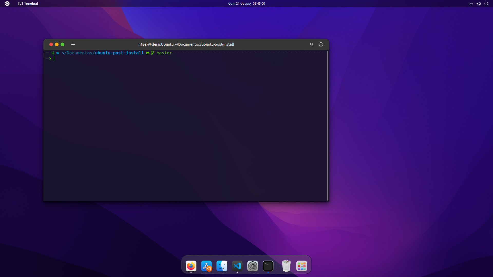

# ubuntu-post-installer

This is my own custom script to setup Ubuntu 22.04. MacOS like.

## Installation
### 1- Clone this repository
```
git clone https://github.com/N1sek/ubuntu-post-installer
cd ubuntu-post-install
```

### 2- Add permissions and run the script 
```
sudo chmod +x setup-ubuntu.sh
./setup-ubuntu.sh
```

### 3- Reboot
```
reboot
```
## Final Result
Your Ubuntu should look like this:


## Notes
I am not responsible for any possible errors that may occur on your computer.

It is recommended to run these scripts after you have freshly installed Ubuntu

You should check the script to see if it suit your needs


## Contributing
If you have a suggestion that would make this better, click [here.](https://github.com/N1sek/ubuntu-post-install/issues) Improvements are always welcome!

## Acknowledgements

[Best-README-Template](https://github.com/othneildrew/Best-README-Template/blob/master/README.md)

[Vinceliuice's WhiteSur Theme](https://github.com/vinceliuice/WhiteSur-gtk-theme)

[Blur-my-shell](https://github.com/aunetx/gnome-shell-extension-blur-my-shell)

[Compiz-alike-magic-lamp-effect](https://github.com/hermes83/compiz-alike-magic-lamp-effect)
